# DizhTime System Diagrams

## System Architecture

```mermaid
graph TB
    %% Frontend Layer
    Frontend[🌐 React Frontend<br/>User Interface] --> Gateway[🚪 API Gateway<br/>Central Entry Point]

    %% Microservices Layer
    Gateway --> UserService[👤 User Service<br/>Authentication & Profiles]
    Gateway --> RestaurantService[🍽️ Restaurant Service<br/>Menu & Orders]
    Gateway --> DeliveryService[🚚 Delivery Service<br/>Tracking & Assignment]
    Gateway --> AdminService[👨‍💼 Admin Service<br/>Management & Analytics]
    Gateway --> ChatbotService[🤖 Chatbot Service<br/>AI Support]

    %% Database Layer
    UserService --> Database[(🗄️ MongoDB<br/>Primary Database)]
    RestaurantService --> Database
    DeliveryService --> Database
    AdminService --> Database
    ChatbotService --> Database

    %% External Services
    UserService --> PaymentGateway[💳 Payment Gateway<br/>Stripe/PayPal]
    DeliveryService --> MapsAPI[🗺️ Maps API<br/>Google Maps]
    ChatbotService --> AI[🧠 AI Services<br/>OpenAI/Custom ML]

    %% Shared Package
    UserService -.-> Common[📦 @dizhtime/common<br/>Shared Utilities]
    RestaurantService -.-> Common
    DeliveryService -.-> Common
    AdminService -.-> Common
    ChatbotService -.-> Common
    Gateway -.-> Common

    %% Styling
    classDef frontend fill:#e1f5fe,stroke:#01579b,stroke-width:3px,color:#000
    classDef gateway fill:#f3e5f5,stroke:#4a148c,stroke-width:3px,color:#000
    classDef services fill:#e8f5e8,stroke:#1b5e20,stroke-width:2px,color:#000
    classDef database fill:#fff3e0,stroke:#e65100,stroke-width:2px,color:#000
    classDef external fill:#fce4ec,stroke:#880e4f,stroke-width:2px,color:#000
    classDef shared fill:#f1f8e9,stroke:#33691e,stroke-width:2px,color:#000

    class Frontend frontend
    class Gateway gateway
    class UserService,RestaurantService,DeliveryService,AdminService,ChatbotService services
    class Database database
    class PaymentGateway,MapsAPI,AI external
    class Common shared
```

## User Order Flow

```mermaid
sequenceDiagram
    participant U as 👤 User
    participant G as 🚪 API Gateway
    participant US as 👤 User Service
    participant RS as 🍽️ Restaurant Service
    participant DS as 🚚 Delivery Service
    participant P as 💳 Payment Gateway

    Note over U,P: 🔐 Authentication Phase
    U->>+G: 🔑 Login Request
    G->>+US: Validate Credentials
    US->>US: 🔍 Check User & Password
    US->>-G: ✅ JWT Token
    G->>-U: 🎉 Login Success

    Note over U,P: 🍽️ Browse & Select Phase
    U->>+G: 🔍 Browse Restaurants
    G->>+RS: Get Available Restaurants
    RS->>RS: 📋 Query Restaurant Data
    RS->>-G: 🏪 Restaurant List
    G->>-U: 📱 Display Restaurants

    U->>+G: 🛒 View Menu
    G->>+RS: Get Menu Items
    RS->>-G: 🍕 Menu Data
    G->>-U: 📋 Display Menu

    Note over U,P: 💰 Order & Payment Phase
    U->>+G: 🛍️ Place Order
    G->>+US: Process Order & Payment
    US->>+P: 💳 Charge Payment
    P->>P: 🔒 Process Transaction
    P->>-US: ✅ Payment Success
    US->>+RS: 📝 Create Order
    RS->>RS: 💾 Save Order Details
    RS->>+DS: 🚚 Request Delivery
    DS->>DS: 👨‍🚀 Assign Delivery Boy
    DS->>-RS: ✅ Delivery Assigned
    RS->>-US: 📋 Order Created
    US->>-G: 🎯 Order Confirmation
    G->>-U: 🎉 Order Confirmed + Tracking

    Note over U,P: 📍 Real-time Tracking
    loop 🔄 Live Updates
        DS->>G: 📍 Location Updates
        G->>U: 🚚 Delivery Status
    end
```

## Restaurant Workflow

```mermaid
flowchart TD
    A[🔑 Restaurant Login] --> B[📋 View Dashboard]
    B --> C{🔔 New Order?}

    C -->|✅ Yes| D{🤔 Accept Order?}
    C -->|❌ No| E[⚙️ Manage Operations]

    D -->|✅ Accept| F[👨‍🍳 Prepare Food]
    D -->|❌ Reject| G[📱 Notify Customer]

    F --> H[✅ Mark Ready]
    H --> I[📞 Call Delivery]
    I --> J[🚚 Pickup Confirmed]
    J --> K[🎉 Order Complete]

    G --> L[💰 Process Refund]
    L --> M[📧 Send Notification]

    E --> N[🍕 Update Menu]
    E --> O[🏪 Update Profile]
    E --> P[📊 View Analytics]

    K --> B
    M --> B
    N --> B
    O --> B
    P --> B

    %% Styling
    classDef startEnd fill:#e8f5e8,stroke:#2e7d32,stroke-width:3px,color:#000
    classDef decision fill:#fff3e0,stroke:#f57c00,stroke-width:2px,color:#000
    classDef process fill:#e3f2fd,stroke:#1976d2,stroke-width:2px,color:#000
    classDef success fill:#e8f5e8,stroke:#388e3c,stroke-width:2px,color:#000
    classDef reject fill:#ffebee,stroke:#d32f2f,stroke-width:2px,color:#000
    classDef manage fill:#f3e5f5,stroke:#7b1fa2,stroke-width:2px,color:#000

    class A,K startEnd
    class C,D decision
    class B,F,H,I,J process
    class F,H,I,J,K success
    class G,L,M reject
    class E,N,O,P manage
```

## Delivery Workflow

```mermaid
flowchart TD
    A[🔑 Delivery Boy Login] --> B[🟢 Set Available Status]
    B --> C{📱 New Order?}

    C -->|✅ Yes| D[📋 View Order Details]
    C -->|❌ No| E[📍 Update Location]
    E --> C

    D --> F{🤔 Accept Delivery?}
    F -->|✅ Accept| G[🗺️ Navigate to Restaurant]
    F -->|❌ Decline| H[❌ Order Reassigned]
    H --> C

    G --> I[🏪 Arrive at Restaurant]
    I --> J[📦 Pickup Food]
    J --> K[🚗 Navigate to Customer]

    K --> L[📍 Real-time Tracking]
    L --> M[🏠 Arrive at Customer]
    M --> N[🤝 Deliver Order]
    N --> O[✅ Confirm Delivery]
    O --> P[🎉 Order Complete]
    P --> Q[💰 Collect Payment]
    Q --> B

    %% Styling
    classDef login fill:#e8f5e8,stroke:#2e7d32,stroke-width:3px,color:#000
    classDef available fill:#e3f2fd,stroke:#1976d2,stroke-width:2px,color:#000
    classDef decision fill:#fff3e0,stroke:#f57c00,stroke-width:2px,color:#000
    classDef navigation fill:#f3e5f5,stroke:#7b1fa2,stroke-width:2px,color:#000
    classDef pickup fill:#fff8e1,stroke:#f9a825,stroke-width:2px,color:#000
    classDef delivery fill:#e8f5e8,stroke:#388e3c,stroke-width:2px,color:#000
    classDef complete fill:#e1f5fe,stroke:#0277bd,stroke-width:3px,color:#000
    classDef reject fill:#ffebee,stroke:#d32f2f,stroke-width:2px,color:#000

    class A login
    class B,E available
    class C,F decision
    class G,K,L navigation
    class I,J pickup
    class M,N,O delivery
    class P,Q complete
    class H reject
```

## Service Communication

```mermaid
graph TB
    subgraph "🌐 Frontend Layer"
        React[📱 React App<br/>User Interface]
        Mobile[📱 Mobile App<br/>iOS/Android]
    end

    subgraph "🚪 API Layer"
        Gateway[🚪 API Gateway<br/>Rate Limiting • Auth • Routing]
    end

    subgraph "⚙️ Microservices Layer"
        User[👤 User Service<br/>Auth • Profile • Orders]
        Restaurant[🍽️ Restaurant Service<br/>Menu • Restaurant Data]
        Delivery[🚚 Delivery Service<br/>Tracking • Assignment]
        Admin[👨‍💼 Admin Service<br/>Management • Analytics]
        Chatbot[🤖 Chatbot Service<br/>AI Support • Chat]
    end

    subgraph "🗄️ Data Layer"
        DB[(🗄️ MongoDB<br/>Primary Database)]
        Cache[(⚡ Redis Cache<br/>Session • Performance)]
        Files[(📁 File Storage<br/>Images • Documents)]
    end

    subgraph "🔌 External APIs"
        Payment[💳 Payment Gateway<br/>Stripe • PayPal]
        Maps[🗺️ Maps API<br/>Google Maps]
        AI[🧠 AI Services<br/>OpenAI • Custom ML]
        SMS[📱 SMS Service<br/>Notifications]
    end

    %% Frontend to Gateway
    React <--> Gateway
    Mobile <--> Gateway

    %% Gateway to Services
    Gateway <--> User
    Gateway <--> Restaurant
    Gateway <--> Delivery
    Gateway <--> Admin
    Gateway <--> Chatbot

    %% Services to Data
    User --> DB
    Restaurant --> DB
    Delivery --> DB
    Admin --> DB
    Chatbot --> DB

    User --> Cache
    Restaurant --> Cache
    Delivery --> Cache

    Restaurant --> Files
    User --> Files

    %% External Integrations
    User --> Payment
    User --> SMS
    Delivery --> Maps
    Chatbot --> AI

    %% Styling
    classDef frontend fill:#e1f5fe,stroke:#01579b,stroke-width:3px,color:#000
    classDef gateway fill:#f3e5f5,stroke:#4a148c,stroke-width:3px,color:#000
    classDef services fill:#e8f5e8,stroke:#1b5e20,stroke-width:2px,color:#000
    classDef data fill:#fff3e0,stroke:#e65100,stroke-width:2px,color:#000
    classDef external fill:#fce4ec,stroke:#880e4f,stroke-width:2px,color:#000

    class React,Mobile frontend
    class Gateway gateway
    class User,Restaurant,Delivery,Admin,Chatbot services
    class DB,Cache,Files data
    class Payment,Maps,AI,SMS external
```

## Admin Dashboard

```mermaid
graph LR
    A[🔑 Admin Login] --> B[📊 Admin Dashboard]

    B --> C[👥 User Management<br/>👀 View • 🚫 Block • 📋 Reports]
    B --> D[🏪 Restaurant Management<br/>✅ Approve • 📊 Monitor • ⚠️ Support]

    B --> E[📦 Order Management<br/>📋 View • ⚖️ Disputes • 💰 Refunds]
    B --> F[🚚 Delivery Management<br/>📍 Track • 🔄 Assign • ⏱️ Performance]

    B --> G[📈 Analytics Hub<br/>💰 Revenue • 📊 Metrics • 🎯 Intelligence]

    %% User Management Actions
    C --> C1{👥 User Actions}
    C1 --> C2[👀 View Users]
    C1 --> C3[🚫 Block/Unblock]
    C1 --> C4[📋 Activity Reports]

    %% Restaurant Management Actions
    D --> D1{🏪 Restaurant Actions}
    D1 --> D2[✅ Approve New]
    D1 --> D3[📊 Performance]
    D1 --> D4[⚠️ Handle Issues]

    %% Order Management Actions
    E --> E1{📦 Order Actions}
    E1 --> E2[📋 View Orders]
    E1 --> E3[⚖️ Resolve Disputes]
    E1 --> E4[💰 Process Refunds]

    %% Delivery Management Actions
    F --> F1{� Delivery Actions}
    F1 --> F2[� Live Tracking]
    F1 --> F3[🔄 Order Assignment]
    F1 --> F4[⏱️ Performance Review]

    %% Analytics Actions
    G --> G1{� Analytics Views}
    G1 --> G2[� Revenue Dashboard]
    G1 --> G3[📊 System Metrics]
    G1 --> G4[🎯 Business Intelligence]

    %% Styling
    classDef login fill:#e8f5e8,stroke:#2e7d32,stroke-width:4px,color:#000
    classDef dashboard fill:#e3f2fd,stroke:#1976d2,stroke-width:4px,color:#000
    classDef mainModules fill:#f3e5f5,stroke:#7b1fa2,stroke-width:3px,color:#000
    classDef actionGroups fill:#fff3e0,stroke:#f57c00,stroke-width:2px,color:#000
    classDef actions fill:#f1f8e9,stroke:#33691e,stroke-width:2px,color:#000

    class A login
    class B dashboard
    class C,D,E,F,G mainModules
    class C1,D1,E1,F1,G1 actionGroups
    class C2,C3,C4,D2,D3,D4,E2,E3,E4,F2,F3,F4,G2,G3,G4 actions
```

## Chatbot Flow

```mermaid
flowchart TD
    A[💬 User Message] --> B[🤖 Chatbot Service]
    B --> C{🔍 Analyze Message Type}

    C -->|🍕 Food Suggestion| D[🏪 Query Restaurant Service]
    C -->|📦 Order Help| E[📋 Check Order Status]
    C -->|❓ General Query| F[🧠 AI Processing]

    D --> G[🍽️ Generate Food Recommendations]
    E --> H[📊 Return Order Information]
    F --> I[💭 Generate AI Response]

    G --> J[📱 Send to User]
    H --> J
    I --> J
    J --> K[💾 Log Conversation]

    %% Styling
    classDef input fill:#e3f2fd,stroke:#1976d2,stroke-width:2px,color:#000
    classDef service fill:#f3e5f5,stroke:#7b1fa2,stroke-width:3px,color:#000
    classDef decision fill:#fff3e0,stroke:#f57c00,stroke-width:2px,color:#000
    classDef processing fill:#e8f5e8,stroke:#388e3c,stroke-width:2px,color:#000
    classDef output fill:#e1f5fe,stroke:#0277bd,stroke-width:2px,color:#000
    classDef storage fill:#fff8e1,stroke:#f9a825,stroke-width:2px,color:#000

    class A input
    class B service
    class C decision
    class D,E,F,G,H,I processing
    class J output
    class K storage
```

## Authentication Flow

```mermaid
sequenceDiagram
    participant U as 👤 User
    participant G as 🚪 Gateway
    participant US as 🔐 User Service
    participant DB as 🗄️ Database

    Note over U,DB: 🔐 Registration/Login Process
    U->>+G: 🔑 Register/Login Request
    G->>+US: Validate Credentials
    US->>+DB: 🔍 Check User Exists
    DB->>-US: 👤 User Data
    US->>US: 🔒 Hash Password / Verify
    US->>US: 🎫 Generate JWT Token
    US->>-G: ✅ Authentication Success + Token
    G->>-U: 🎉 Login Successful

    Note over U,DB: 🔒 Protected API Access
    U->>+G: 📡 API Request + JWT Token
    G->>G: 🔍 Validate JWT Token
    G->>+US: Forward Authenticated Request
    US->>+DB: 📊 Query Data
    DB->>-US: 📋 Return Data
    US->>-G: 📦 API Response
    G->>-U: ✅ Secure Data Response
```

## Real-time Tracking

```mermaid
graph TD
    A[📦 Order Placed] --> B[🔌 WebSocket Connection]

    B --> C[🏪 Restaurant Notification]
    B --> D[👤 User Tracking Interface]
    B --> E[👨‍💼 Admin Dashboard]

    C --> F[📊 Order Status Updates]
    D --> G[📍 Live Location Tracking]
    E --> H[📈 System Monitoring]

    F --> I[📱 Push Notifications]
    G --> I
    H --> I

    I --> J[📧 Email Notifications]
    I --> K[📱 SMS Alerts]

    %% Styling
    classDef start fill:#e8f5e8,stroke:#2e7d32,stroke-width:3px,color:#000
    classDef connection fill:#e3f2fd,stroke:#1976d2,stroke-width:3px,color:#000
    classDef notification fill:#fff3e0,stroke:#f57c00,stroke-width:2px,color:#000
    classDef tracking fill:#f3e5f5,stroke:#7b1fa2,stroke-width:2px,color:#000
    classDef output fill:#e1f5fe,stroke:#0277bd,stroke-width:2px,color:#000

    class A start
    class B connection
    class C,D,E notification
    class F,G,H tracking
    class I,J,K output
```

## Complete Data Flow

```mermaid
graph TB
    subgraph "📱 User Interface Layer"
        UI[🌐 Web App<br/>React Frontend]
        Mobile[📱 Mobile App<br/>React Native]
        Admin[👨‍💼 Admin Panel<br/>Management Interface]
    end

    subgraph "🚪 API Gateway Layer"
        Gateway[🚪 API Gateway<br/>Authentication • Rate Limiting • Routing]
    end

    subgraph "⚙️ Business Logic Layer"
        Services[🔧 Microservices<br/>User • Restaurant • Delivery • Admin • Chatbot]
        Common[📦 @dizhtime/common<br/>Shared Utilities • HTTP Status • Response Handler]
    end

    subgraph "🗄️ Data Persistence Layer"
        DB[(🗄️ MongoDB<br/>Primary Database)]
        Cache[(⚡ Redis Cache<br/>Session • Performance)]
        Files[(📁 File Storage<br/>Images • Documents)]
    end

    subgraph "🔌 External Services Layer"
        Payment[💳 Payment APIs<br/>Stripe • PayPal]
        Maps[🗺️ Location APIs<br/>Google Maps • Geolocation]
        AI[🧠 AI/ML Services<br/>OpenAI • Custom Models]
        Notifications[📱 Notification Services<br/>SMS • Email • Push]
    end

    %% Connections
    UI --> Gateway
    Mobile --> Gateway
    Admin --> Gateway

    Gateway --> Services
    Services --> Common

    Services --> DB
    Services --> Cache
    Services --> Files

    Services --> Payment
    Services --> Maps
    Services --> AI
    Services --> Notifications

    %% Styling
    classDef ui fill:#e1f5fe,stroke:#01579b,stroke-width:3px,color:#000
    classDef gateway fill:#f3e5f5,stroke:#4a148c,stroke-width:3px,color:#000
    classDef business fill:#e8f5e8,stroke:#1b5e20,stroke-width:2px,color:#000
    classDef data fill:#fff3e0,stroke:#e65100,stroke-width:2px,color:#000
    classDef external fill:#fce4ec,stroke:#880e4f,stroke-width:2px,color:#000

    class UI,Mobile,Admin ui
    class Gateway gateway
    class Services,Common business
    class DB,Cache,Files data
    class Payment,Maps,AI,Notifications external
```

